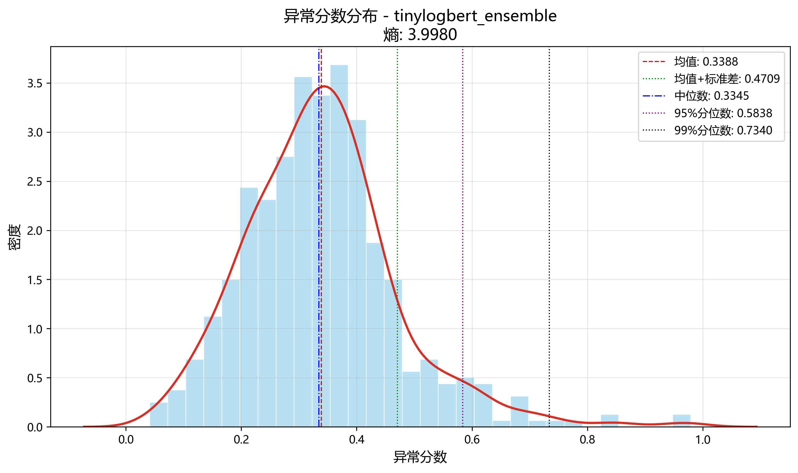
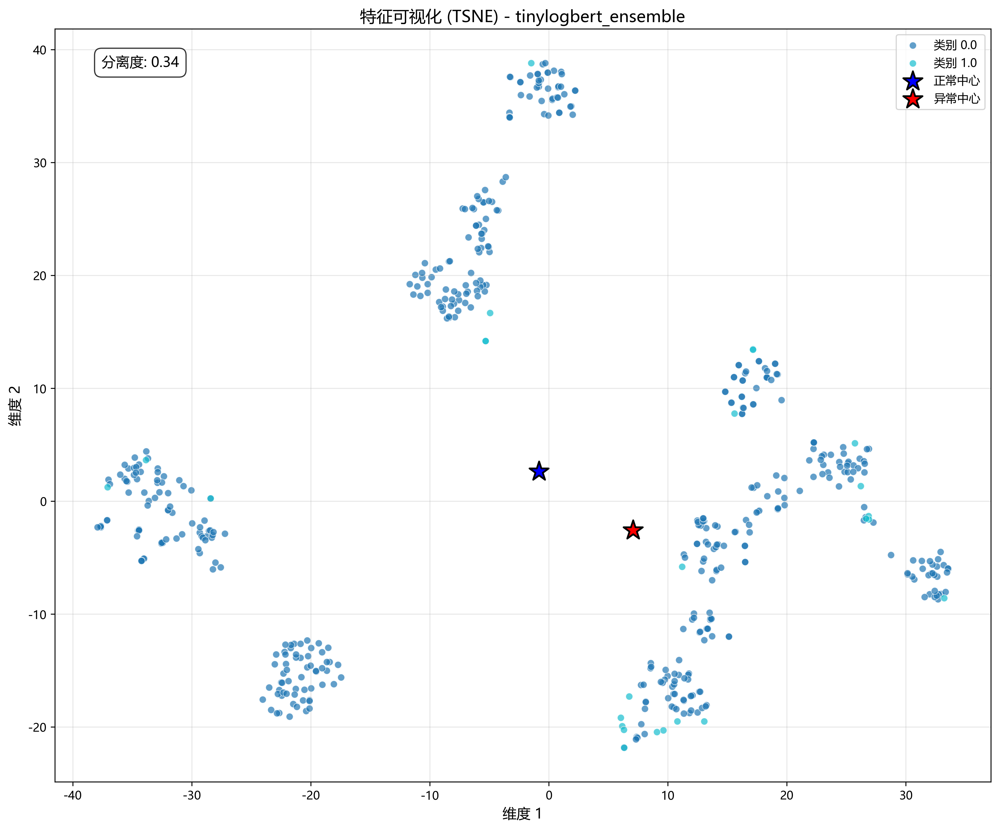
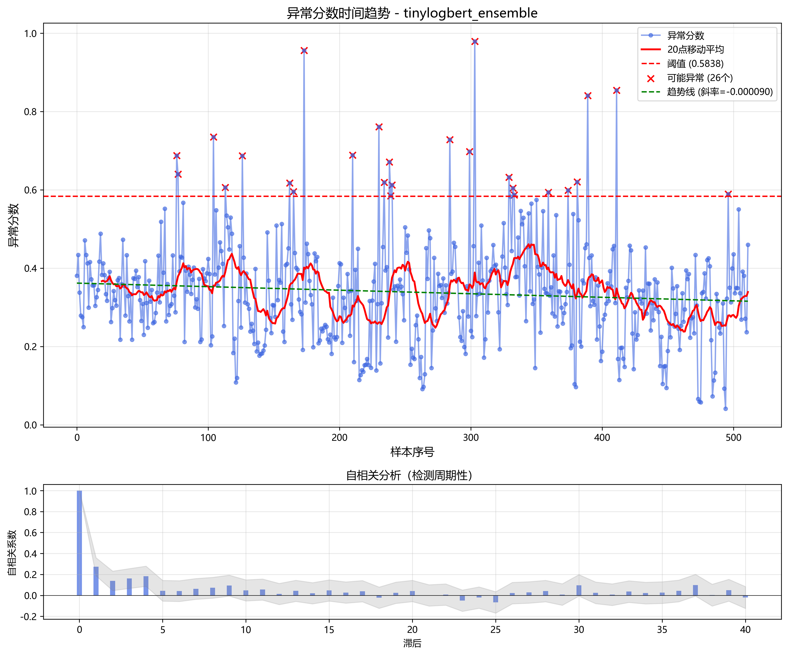

# 无监督模型评估报告

## 基本信息

- **模型名称**: tinylogbert_ensemble
- **评估时间**: 2025-04-05 20:40:08
- **样本数量**: 512
- **推荐阈值**: 0.5838
- **异常样本数**: 26 (5.08%)

## 模型评估

- **评估等级**: 一般
- **评分**: 45
- **评估摘要**: 模型表现一般，检测效果有限，可能需要调整

### 评估因素

- 分数分布呈现右偏趋势，对异常检测有一定帮助
- 分数熵较高，分数分布较为混乱，难以区分正常和异常
- 异常比例为5.08%，略高，可能需要提高阈值
- 分数变异系数适中，模型有一定的区分能力
- LOF得分一般，异常样本在特征空间中的离群特性不太明显

## 改进建议

- 考虑提高异常阈值，当前阈值可能过低
- 建议尝试其他检测方法或调整特征提取

## 分数分布统计

| 指标 | 值 |
| --- | --- |
| mean | 0.3388 |
| median | 0.3345 |
| std | 0.1321 |
| min | 0.0415 |
| max | 0.9792 |
| range | 0.9377 |
| percentile_95 | 0.5838 |
| percentile_99 | 0.7340 |
| skewness | 0.9246 |
| kurtosis | 2.4524 |
| iqr | 0.1504 |
| entropy | 3.9980 |
| separation_index | 4.8487 |

## 内部一致性指标

| 指标 | 值 |
| --- | --- |
| features_provided | True |
| timestamps_provided | True |
| texts_provided | True |
| score_entropy | 3.9980 |
| coefficient_of_variation | 0.3899 |
| lof_score | -0.9844 |

## 可视化分析

### 分数分布

### 特征可视化

### 时间趋势分析

