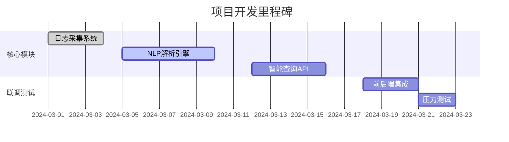

---

### **3人团队详细分工与接口标准化设计**

---

#### **一、角色分工与核心职责**
| **成员**          | **核心任务**                                                 | **交付物**                                               |
| ----------------- | ------------------------------------------------------------ | -------------------------------------------------------- |
| **前端开发（A）** | 1. 构建可视化Web界面（仪表盘、查询表单）<br>2. 对接后端API渲染数据<br>3. 用户交互设计 | React/Next.js工程、可视化组件库、API调用代码             |
| **后端开发（B）** | 1. 搭建API服务与数据库<br>2. 日志接收/存储/预处理<br>3. 调度AI模型服务 | FastAPI服务、Elasticsearch索引、日志处理流水线           |
| **AI工程师（C）** | 1. 训练NLP模型（日志解析/异常检测）<br>2. 封装模型推理API<br>3. 生成安全报告 | 微调后的BERT/GPT模型、模型推理API服务、自然语言转SQL模块 |

---

#### **二、标准化接口定义**
团队通过**REST API**和**数据协议**解耦协作，关键接口如下：

##### **1. 前端 ↔ 后端接口**
```python
# 接口1：获取日志列表
GET /api/logs
Params: { start_time: str, end_time: str, log_type: str }
Response: { logs: [{id, timestamp, source, raw_text, parsed_json}, ...] }

# 接口2：提交自然语言查询
POST /api/query
Body: { query: "最近24小时admin登录失败次数" }
Response: { sql: "SELECT COUNT(*) FROM logs WHERE ...", result: [...] }

# 接口3：获取告警信息
GET /api/alerts
Response: { alerts: [{id, level, message, timestamp}, ...] }
```

##### **2. 后端 ↔ AI服务接口**
```python
# 接口4：自然语言转SQL（AI服务）
POST /ai/nl2sql
Body: { query: "最近24小时admin登录失败次数" }
Response: { sql: "SELECT ...", confidence: 0.92 }

# 接口5：日志异常检测（AI服务）
POST /ai/detect_anomaly
Body: { log_text: "User admin failed to login from 192.168.1.100" }
Response: { is_anomaly: True, score: 0.87, reason: "多次登录失败" }

# 接口6：生成安全报告（AI服务）
POST /ai/generate_report
Body: { logs: [...] }
Response: { report: "## 安全事件摘要\n1. 检测到3次异常登录..." }
```

##### **3. 数据格式标准化**
```json
// 日志数据格式（Elasticsearch存储）
{
  "timestamp": "2024-02-20T14:30:00Z",
  "source": "windows_event_log",
  "raw_text": "User 'admin' failed to login",
  "parsed": {  // NLP解析后的结构化数据
    "event_type": "login_failed",
    "user": "admin",
    "ip": "192.168.1.100"
  }
}
```

---

#### **三、项目目录结构**
```markdown
project-root/
├── frontend/                 # 前端工程（A负责）
│   ├── src/
│   │   ├── components/       # React组件（查询表单、图表等）
│   │   ├── pages/            # Next.js页面（仪表盘、报告页）
│   │   ├── services/         # API调用封装（axios实例）
│   │   └── styles/           # CSS/SCSS样式
│   └── package.json
│
├── backend/                  # 后端工程（B负责）
│   ├── app/
│   │   ├── routes/           # FastAPI路由（logs.py, alerts.py）
│   │   ├── models/           # 数据库模型（LogModel.py）
│   │   ├── utils/            # 工具类（日志解析器、AI客户端）
│   │   └── main.py           # FastAPI入口
│   ├── elasticsearch/        # ES索引配置（log_index.json）
│   └── requirements.txt
│
├── ai/                       # AI工程（C负责）
│   ├── training/             # 模型训练代码
│   │   ├── train_bert.py     # BERT微调脚本
│   │   └── data/            # 训练数据集（labeled_logs.csv）
│   ├── inference/            # 模型推理服务
│   │   ├── nl2sql_api.py     # 自然语言转SQL服务
│   │   └── anomaly_detect.py # 异常检测服务
│   └── requirements.txt
│
├── docker/                   # Docker部署配置
│   ├── frontend.Dockerfile
│   ├── backend.Dockerfile
│   └── ai.Dockerfile
│
├── docs/                     # 文档
│   ├── API.md               # Swagger接口文档
│   └── ARCHITECTURE.md       # 系统架构说明
│
└── .github/workflows/        # CI/CD流水线（GitHub Actions）
    └── main.yml
```

---

#### **四、协作流程与工具**
1. **代码协作**  
   - 使用 **Git Feature Branch** 工作流：每个功能独立分支，通过Pull Request合并到`main`分支。  
   - **分支命名规范**:  
     - `feat/log-query`（前端功能）  
     - `fix/api-connection`（后端修复）  
     - `model/bert-anomaly`（AI模型更新）  

2. **接口联调**  
   - **Mock API**: 前端使用`msw`库模拟后端接口，无需等待后端开发完成。  
   - **Swagger文档**: 后端开发者维护实时API文档，前端/AI按文档对接。  
   ```yaml
   # Swagger示例（FastAPI自动生成）
   paths:
     /api/logs:
       get:
         summary: 获取日志列表
         parameters: [...]
   ```

3. **数据流验证**  
   - **端到端测试**: 使用`Postman`预置测试用例集，每日运行验证核心流程：  
     ```text
     日志上传 → NLP解析 → 异常检测 → 前端展示
     ```

4. **每日站会**  
   - **同步内容**:  
     - 前端：UI进展、API调用问题  
     - 后端：新接口完成状态、性能瓶颈  
     - AI：模型准确率、训练时间预估  

---

#### **五、关键检查点**
| **阶段**   | **检查内容**                                                 |
| ---------- | ------------------------------------------------------------ |
| **Day 3**  | 前端完成Mock数据展示，后端搭建Elasticsearch索引，AI完成BERT初步微调 |
| **Day 7**  | 前后端完成日志列表API对接，AI提供`nl2sql`测试接口            |
| **Day 10** | 全链路测试：用户输入自然语言 → AI生成SQL → 后端查询 → 前端渲染图表 |
| **Day 14** | MVP演示：完整展示日志上传、异常检测、报告生成流程            |


---

### **正式项目模块划分与详细技术实施方案**

---

#### **一、项目模块划分**
| **模块**                | **子模块**                                                   | **负责人** | **技术实现**                                       |
| ----------------------- | ------------------------------------------------------------ | ---------- | -------------------------------------------------- |
| **1. 日志采集与预处理** | - 多源日志收集（Syslog/Windows/Firewall）<br>- 日志清洗与标准化 | B          | Logstash/Fluentd 管道 + 正则表达式/NLP 字段提取    |
| **2. NLP日志解析**      | - 结构化字段提取<br>- 日志分类（登录/攻击/系统）             | C          | Hugging Face BERT微调（序列标注+文本分类）         |
| **3. 智能查询引擎**     | - 自然语言转SQL<br>- 语义搜索                                | C          | GPT-3.5微调（文本到SQL） + Elasticsearch DSL生成   |
| **4. 异常检测**         | - 监督学习（已知攻击模式）<br>- 无监督学习（新颖异常检测）   | C          | BERT+BiLSTM（有监督） + Isolation Forest（无监督） |
| **5. 告警系统**         | - 动态阈值调整<br>- 告警聚合                                 | B          | 滑动窗口统计 + 强化学习（DQN）优化                 |
| **6. 报告生成**         | - 自动摘要<br>- 修复建议生成                                 | C          | GPT-4提示工程 + 模板填充                           |
| **7. 前端可视化**       | - 实时日志仪表盘<br>- 交互式查询界面                         | A          | React+D3.js + ECharts                              |
| **8. API网关**          | - 鉴权与限流<br>- 请求路由                                   | B          | FastAPI Middleware + JWT/OAuth2                    |

---

#### **二、数据库构建方案**
##### **1. 核心数据表设计**
```python
# Elasticsearch 索引（日志存储）
logs-*:
  mappings:
    properties:
      timestamp: { type: "date" }
      source: { type: "keyword" }  # 日志来源（e.g., firewall, windows）
      raw_text: { type: "text" }   # 原始日志
      parsed:                     # NLP解析后结构
        event_type: { type: "keyword" }  # e.g., "login_failed"
        user: { type: "keyword" }
        ip: { type: "ip" }
        severity: { type: "integer" }
      embeddings: { type: "dense_vector", dims: 768 }  # BERT向量（用于相似搜索）

# PostgreSQL（业务数据）
tables:
  - users:  # 系统用户
  - alerts:  # 告警记录
  - query_history:  # 用户查询历史
```

##### **2. 技术选型**
- **日志存储**: Elasticsearch（分布式搜索+高吞吐写入）  
- **业务数据**: PostgreSQL（ACID事务支持）  
- **缓存**: Redis（告警阈值计算加速）  
- **向量数据库**: FAISS（可选，用于相似日志检索）  

---

#### **三、前后端交互设计**
##### **1. 关键接口规范**
```yaml
# 接口1：提交日志（前端 → 后端）
POST /api/v1/logs/ingest
Headers:
  Content-Type: application/json
Body:
  { "logs": [ {"raw_text": "Failed login for admin", "source": "firewall"}, ...] }
Response:
  { "success_count": 100, "failed_logs": [] }

# 接口2：自然语言查询（前端 → 后端 → AI服务）
POST /api/v1/query/nl
Body:
  { "query": "过去1小时的高危登录尝试", "user_id": 123 }
Response:
  {
    "sql": "SELECT...",  # 调试用
    "results": [{"timestamp": "...", "ip": "192.168.1.1", ...}],
    "chart_suggestion": "bar"  # AI推荐可视化类型
  }

# 接口3：流式日志推送（后端 → 前端）
WebSocket /ws/logs
Data:
  { "type": "new_log", "log": { ... } }
```

##### **2. 前端工程实践**
- **API调用封装**:
  ```typescript
  // services/api.ts
  const fetchLogs = async (params: LogQueryParams) => {
    const response = await axios.post('/api/v1/query/nl', params);
    if (response.data.chart_suggestion) {
      renderChart(response.results, response.chart_suggestion);
    }
  };
  ```
- **错误处理**:
  - 自动重试（指数退避）
  - 用户友好错误提示（如 "AI引擎超时，请简化查询"）

---

#### **四、AI工程具体任务**
##### **1. 模型训练流程**
| **任务**          | **输入**                  | **输出**                | **工具链**                    |
| ----------------- | ------------------------- | ----------------------- | ----------------------------- |
| 日志分类模型训练  | 标注好的日志数据集（CSV） | BERT分类模型（PyTorch） | Hugging Face Trainer + MLflow |
| 自然语言转SQL微调 | (问题, SQL) 配对数据      | GPT-3.5适配模型         | OpenAI API微调 + 提示工程     |
| 异常检测模型部署  | 训练好的模型文件（.onnx） | Docker容器化API服务     | FastAPI + ONNX Runtime        |

##### **2. 关键代码示例**
```python
# 异常检测API（FastAPI路由）
@app.post("/ai/detect")
async def detect_anomaly(log: LogItem):
    # 文本向量化
    inputs = tokenizer(log.raw_text, return_tensors="pt")
    # BERT推理
    outputs = model(**inputs)
    # 异常评分
    score = anomaly_detector(outputs.last_hidden_state.mean(dim=1))
    return {"is_anomaly": score > 0.7, "score": float(score)}
```

##### **3. 性能优化**
- **模型量化**: 使用`torch.quantize`将BERT模型从FP32转为INT8  
- **缓存机制**: 对常见查询（如"登录失败"）预存检测结果  
- **批处理**: 日志分析请求每100ms聚合一次批量推理  

---

#### **五、联调测试方案**
1. **接口测试**  
   - 使用Postman自动化测试集（含200+测试用例）  
   - 示例用例：  
     ```text
     Given 非JSON日志输入 → Expect 400错误
     When 查询"异常登录" → Then 返回至少1条高危IP记录
     ```

2. **AI模型验证**  
   - **准确率**: 在SecRepo测试集上F1 > 0.85  
   - **延迟**: 单条日志分析 < 150ms（GPU T4环境）  

3. **端到端测试场景**  
   ```gherkin
   Scenario: 管理员生成安全报告
     When 用户输入"生成上周攻击报告"
     Then 前端显示包含"TOP 5攻击IP"的PDF
     And 数据库记录该查询历史
   ```

---

### **实施路线图**


通过以上设计，团队可实现**每日明确交付物**，且所有接口均通过Swagger文档锁定，避免后期联调冲突。